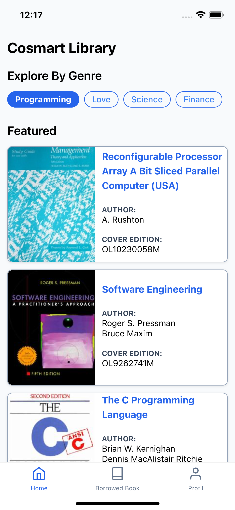
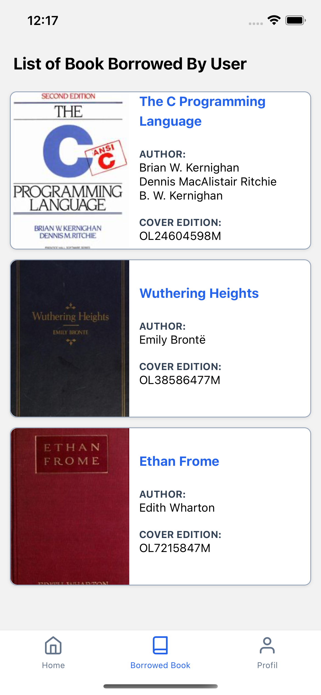

# Cosmart Mobile Test

<p align="center">
    
    
    
</p>

This project use node version 18 & yarn as package manager

## To Do
1. Setup eslint
2. Setup husky

## Installation

1.  This project uses Yarn, so run `yarn install`.

2.  To **run** this project, follow the instrusctions below: 
    a. **Android:**
    ```yarn android```

    b. **iOS**
    ```yarn ios```

3.  To **build** the project, follow the instructions below:

    a. **Android:**

    If you are using Windows, run:

        yarn build:android:windows

    If you are using MacOS, run:

        yarn build:android:ios

    b. **iOS:**
    
    Open the project on Xcode ```(ios folder)```, select menu Product -> Build

    For more docs: https://reactnative.dev/docs/publishing-to-app-store

    Or if you want to cloud build you can use setup ```eas-cli```

## Tech Stack
1. React Native
2. TypeScript
3. Libs Used
  - react-navigation
  - zustand (state management)
  - react-query
  - nativewind (tailwind css wrapper on React Native)
